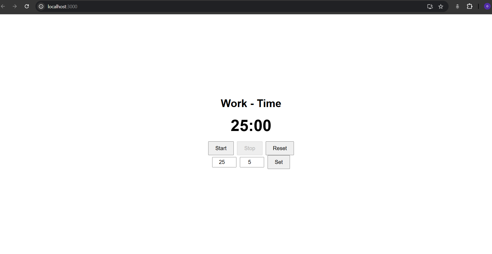

# Pomodoro Timer

A simple and functional Pomodoro Timer built with React. This application helps users efficiently manage their time by alternating between work and break intervals.

## Features

- **Two Modes:** "Work" and "Break."
- **Customizable Durations:** Users can set their desired durations for work and break intervals.
- **Countdown Timer:** Automatically switches between work and break modes after time completion.
- **Functional Buttons:**
  - **Start:** Starts the timer.
  - **Stop:** Pauses the timer.
  - **Reset:** Resets all values to default (25 minutes for work and 5 minutes for break).
  - **Set:** Updates the timer based on user input.
- **Time Format:** Displays the timer in `MM:SS` format.
- **Notification:** Alerts the user when work or break time is complete (Bonus feature).

## Technologies Used

- React (functional components and hooks: `useState`, `useEffect`).
- CSS for basic styling.

## Screenshot



## How to Run the Project Locally

Follow these steps to run the application on your local machine:

1. **Clone the Repository:**
   ```bash
   git clone <repository-url>
   cd pomodoro-timer
